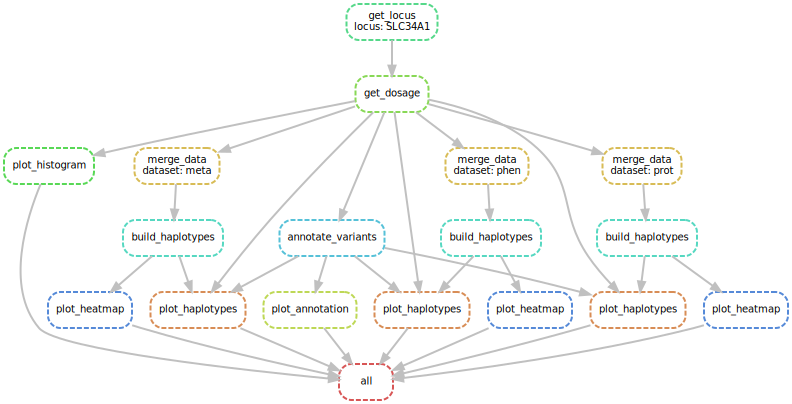

## Haplomics
Haplotype analysis pipeline for genetic loci in population studies with multi-omics data


### Functionality

Haplomics pipeline performs these tasks automatically on each input region:
1. extracting dosage for variants within the defined region from the VCF
2. annotate variants using VEP API
3. depicting allele count/frequencies of the variants
4. depicting annotated consequences of the variants
5. merging extracted genotypes with phenotypes
6. building haplotypes and test their association with the phenotypes
7. representing the haplotypes (full and varied variants)
8. visualizing association results via heatmap plot
9. reporting the results in PDF or HTML


### Input files
The user should provide:
  - a list of genomic regions including chromosomal number, starting position, and ending position of the region. 
  - a VCF genotype file containing the dosage of the best-guessed genotype for the imputed variants
  - phenotypes files (can be more than one esp. for studies like the CHRIS with metabolomics and proteomics)
  - covariates file (optional; usually consisting of genomic principal components and local confounders like age, sex, etc.)


### Run Haplomics

You can run the workflow on your local machine with cluster computing nodes using this command:
```bash
sbatch submit.sh
```

### Haplomics workflow example


